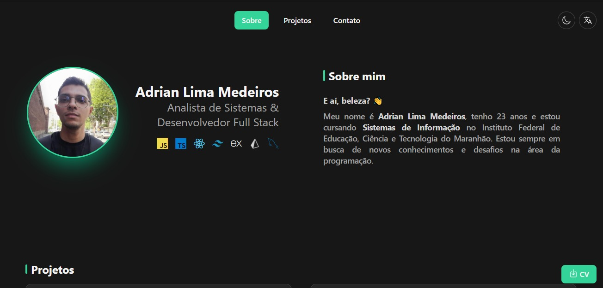

# 💻 Portfolio

 

  

### 🚀 Technologies

This project was developed using these technologies:

- HTML5, Tailwind CSS and JavaScript.
- Git and Github

### ⚖ License

 This project is licensed under <a href="https://opensource.org/license/mit/" target="_blank">The MIT License</a> 

